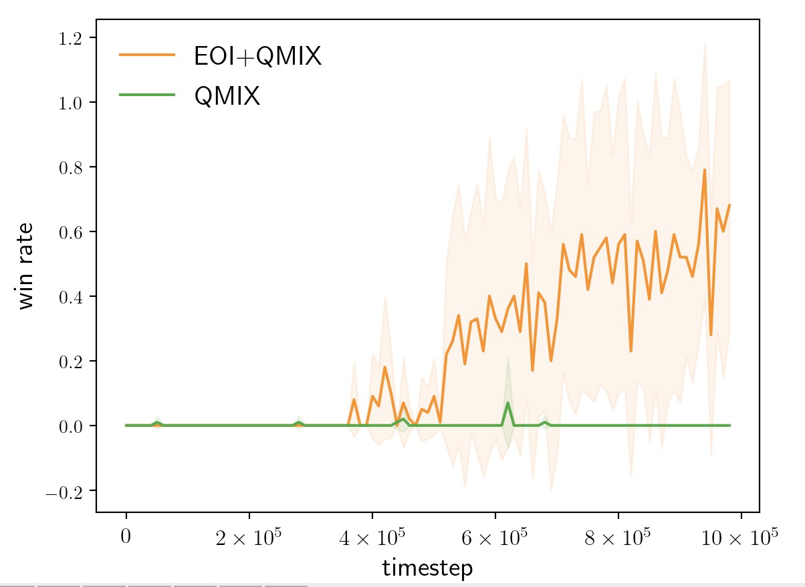

# EOI_on_SMAC

This is an improved version of [EOI](http://proceedings.mlr.press/v139/jiang21g/jiang21g.pdf).

## EOI

EOI learns a probabilistic classifier that predicts a probability distribution over agents given their observation and gives each agent an intrinsic reward of being correctly predicted by the classifier. The intrinsic reward encourages the agents to visit their own familiar observations, and learning the classifier by such observations makes the intrinsic reward signals stronger and in turn makes the agents more identifiable. To further enhance the intrinsic reward and promote the emergence of individuality, two regularizers are proposed to increase the discriminability of the classifier.

In the original version, an auxiliary gradient and update the individual value function by both minimizing the TD error of the joint action-value function and maximizing the cumulative intrinsic rewards. However, in some tasks, the gradients of the two objectives might conflict with each other, which will negatively impact the learning process and lead to low performance in challenging tasks. In the new version, during the interaction, the agent i acts the policy

a_i = argmax(Q_i^a) if episode_num%10 < n else argmax(Q_i^p).

And during the update, the agents are trained by vanilla QMIX without the auxiliary gradient. That is to say, the intrinsic value function Q^p only works in the exploration process, which generates individualized experiences and does not negatively impact the performance.

## So_many_baneling

So_many_baneling is a [SMAC](https://github.com/oxwhirl/smac) task where 7 Zealots fight with 32 Banelings. The key to winning this task is that the Zealots should cooperatively spread out around the map far from each other so that the Banelings' damage is distributed as thinly as possible. The individualized strategy perfectly matches the motivation of EOI. However, the original so_many_baneling is too easy. We set reward_sparse=True, sight_range=4.0, shoot_range=0.0, move_amount=0.3, and simplify the observed information. The modified version (see starcraft2.py) is much more difficult, and vanilla QMIX is hard to explore the winning experiences.

## Performance 

## Citation 
If you are using the codes, please cite our paper.

    @inproceedings{jiang2021emergence,
      title={The Emergence of Individuality},
      author={Jiang, Jiechuan and Lu, Zongqing},
      booktitle={International Conference on Machine Learning},
      pages={4992--5001},
      year={2021},
      organization={PMLR}
    }

